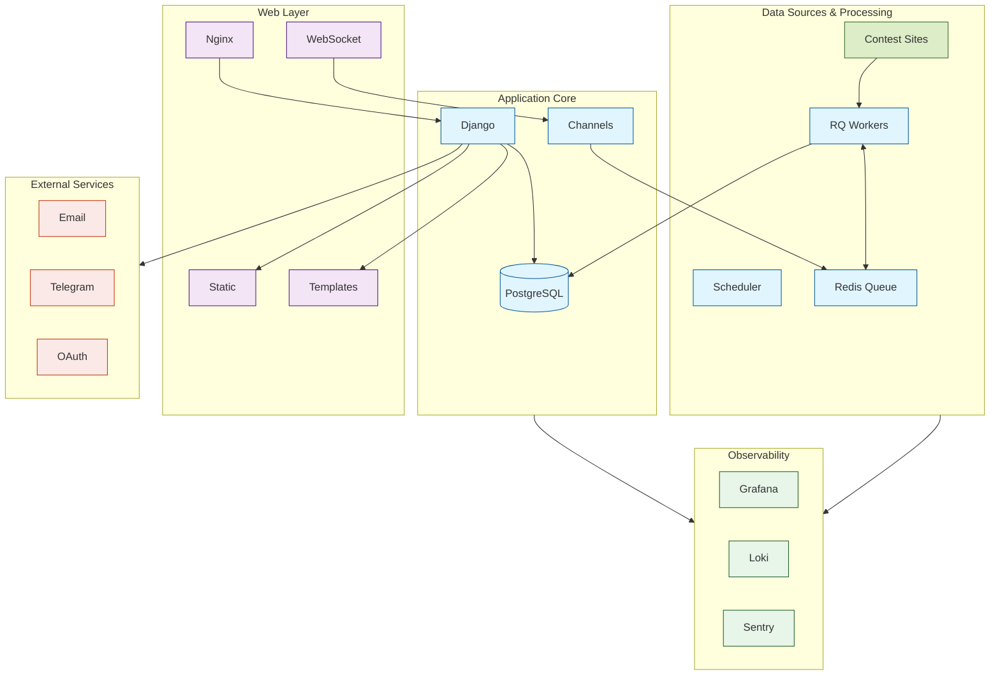

    classDef core fill:#e1f5fe,stroke:#01579b
    classDef web fill:#f3e5f5,stroke:#4a148c
    classDef external fill:#fbe9e7,stroke:#bf360c
    classDef monitoring fill:#e8f5e9,stroke:#1b5e20
    
    class Scheduler,Queue,Workers,DB,Django,Channels,WebSocket core
    class Nginx,Static,Templates,Users web
    class Email,Telegram,OAuth external
    class Grafana,Loki,Sentry monitoring
```
