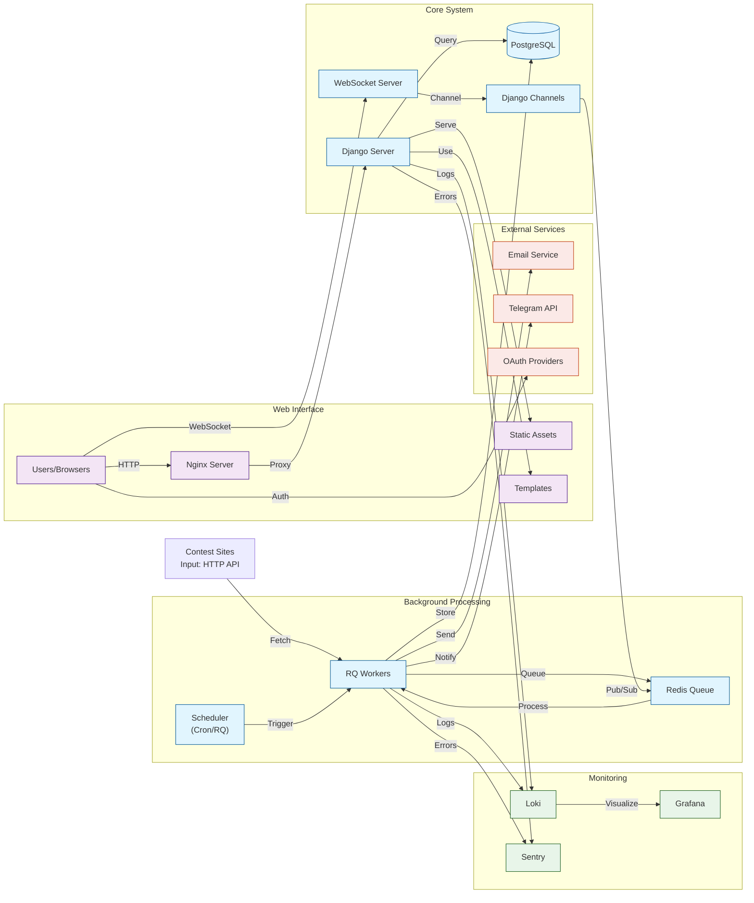

```mermaid
flowchart LR
    %% External sources on left
    ContestSites["Contest Sites<br/>Input: HTTP API"]

    %% Background processing on left
    subgraph Processing["Background Processing"]
        direction TB
        Scheduler["Scheduler<br/>(Cron/RQ)"]
        Queue["Redis Queue"]
        Workers["RQ Workers"]
    end

    %% Core in center
    subgraph CoreSystem["Core System"]
        direction TB
        DB[(PostgreSQL)]
        Django["Django Server"]
        Channels["Django Channels"]
        WebSocket["WebSocket Server"]
    end

    %% Web interface on right
    subgraph WebInterface["Web Interface"]
        direction TB
        Nginx["Nginx Server"]
        Static["Static Assets"]
        Templates["Templates"]
        Users["Users/Browsers"]
    end

    %% External services on far right
    subgraph ExternalServices["External Services"]
        direction TB
        Email["Email Service"]
        Telegram["Telegram API"]
        OAuth["OAuth Providers"]
    end

    %% Monitoring on bottom
    subgraph Monitoring["Monitoring"]
        direction LR
        Grafana["Grafana"]
        Loki["Loki"]
        Sentry["Sentry"]
    end

    %% Core Flows
    ContestSites -->|"Fetch"| Workers
    Scheduler -->|"Trigger"| Workers
    Workers -->|"Store"| DB
    Workers -->|"Queue"| Queue
    Queue -->|"Process"| Workers
    
    %% Web Flows
    Users -->|"HTTP"| Nginx
    Nginx -->|"Proxy"| Django
    Django -->|"Query"| DB
    Django -->|"Use"| Templates
    Django -->|"Serve"| Static
    
    %% Real-time
    Users -->|"WebSocket"| WebSocket
    WebSocket -->|"Channel"| Channels
    Channels -->|"Pub/Sub"| Queue
    
    %% External Service Flows
    Workers -->|"Send"| Email
    Workers -->|"Notify"| Telegram
    Users -->|"Auth"| OAuth
    
    %% Monitoring Flows
    Django -->|"Logs"| Loki
    Workers -->|"Logs"| Loki
    Loki -->|"Visualize"| Grafana
    Django -->|"Errors"| Sentry
    Workers -->|"Errors"| Sentry

    classDef core fill:#e1f5fe,stroke:#01579b
    classDef web fill:#f3e5f5,stroke:#4a148c
    classDef external fill:#fbe9e7,stroke:#bf360c
    classDef monitoring fill:#e8f5e9,stroke:#1b5e20
    
    class Scheduler,Queue,Workers,DB,Django,Channels,WebSocket core
    class Nginx,Static,Templates,Users web
    class Email,Telegram,OAuth external
    class Grafana,Loki,Sentry monitoring
```
