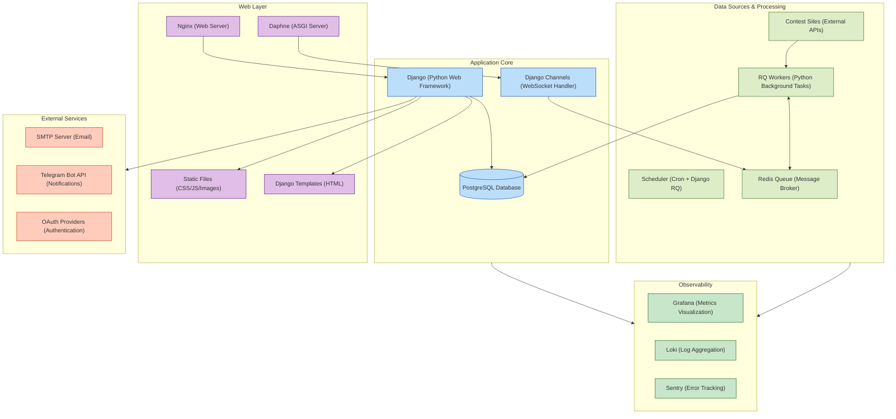

# CLIST Architecture

## System Architecture Diagram

## Technology Stack Details

### Data Sources & Processing
- **Contest Sites**: External programming contest platforms accessed via HTTP APIs
- **Scheduler**: Combination of system Cron jobs and Django-RQ for scheduled tasks
- **RQ Workers**: Python-based background task processors using Django-RQ
- **Redis Queue**: Redis server acting as message broker and task queue

### Application Core
- **PostgreSQL**: Main relational database (v14.3)
- **Django**: Python web framework (with REST framework for APIs)
- **Channels**: Django Channels for WebSocket/real-time functionality

### Web Layer
- **Nginx**: High-performance web server and reverse proxy
- **Static Files**: Served through Nginx with compression
- **Templates**: Django template engine with Bootstrap
- **Daphne**: ASGI server for WebSocket handling

### External Services
- **Email**: SMTP server integration for notifications
- **Telegram**: Bot API integration for notifications and commands
- **OAuth**: Multiple OAuth providers for authentication (social login)

### Observability
- **Grafana**: Metrics visualization and dashboards
- **Loki**: Log aggregation and search
- **Sentry**: Real-time error tracking and monitoring

### Key Technologies Used
- Python 3.10
- Django
- PostgreSQL 14.3
- Redis
- Nginx
- Django RQ
- Django Channels
- Docker & Docker Compose
